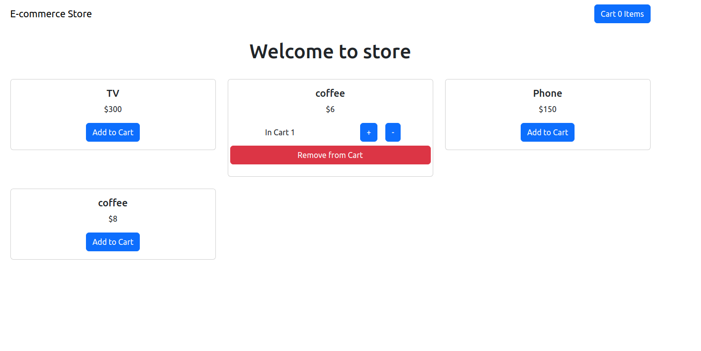
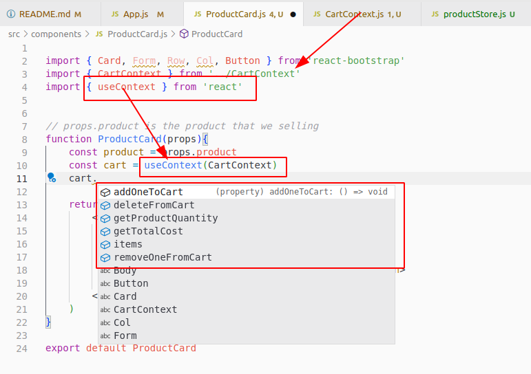
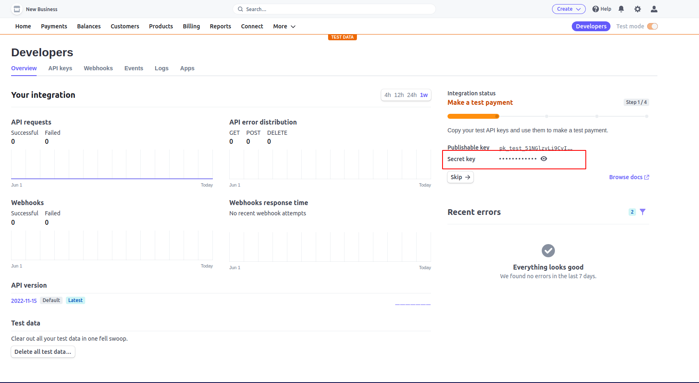
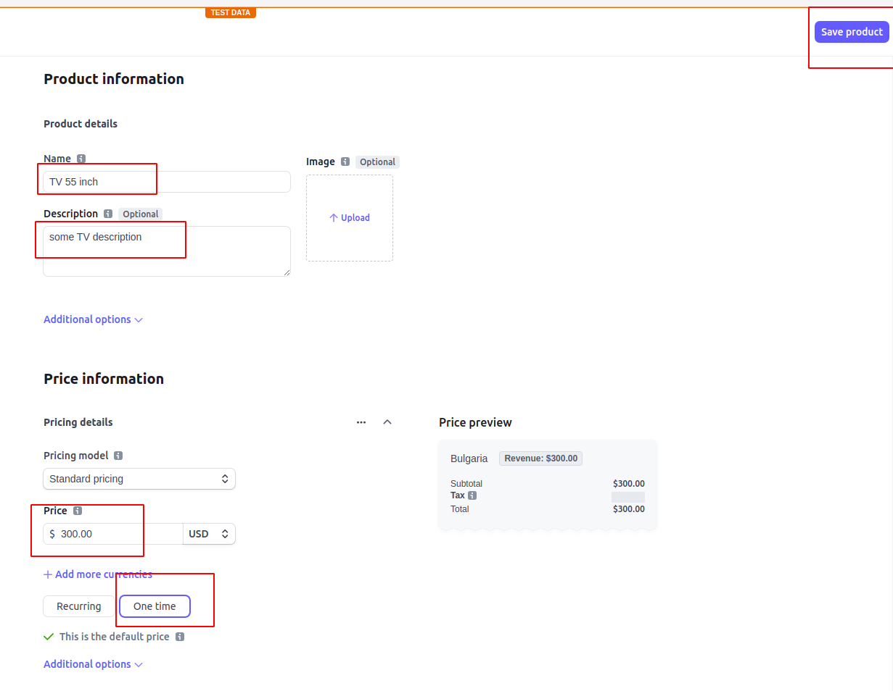
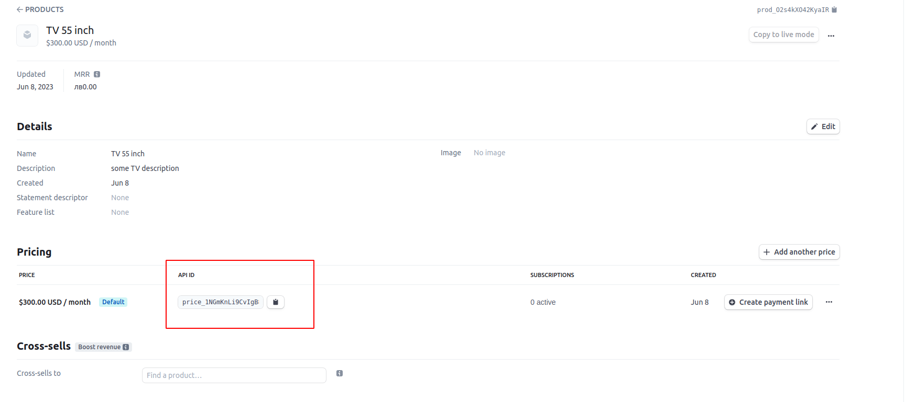
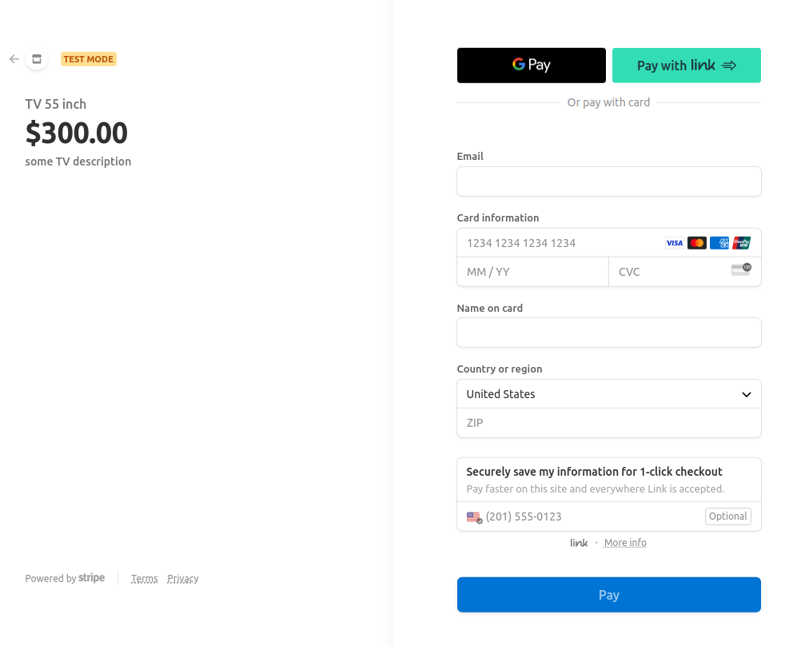
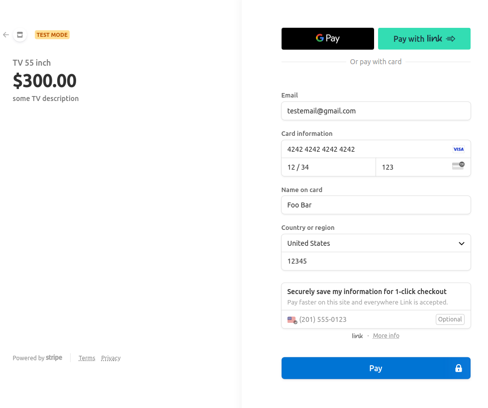
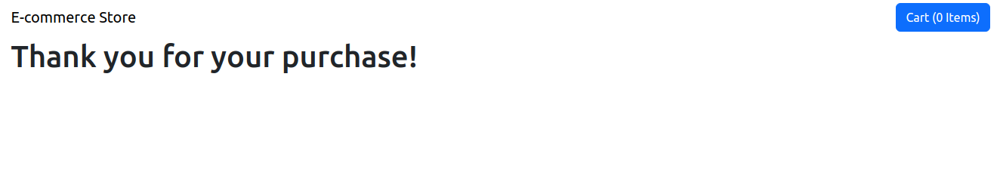
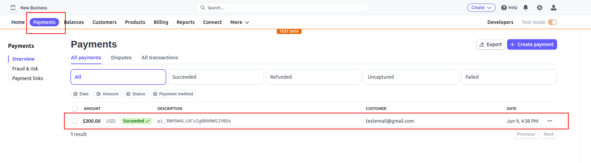

## Create app from scratch
Tech stack: Front-end e-commerce shopping cart with with ReactJS, React-Bootstrap, React-router-dom, Stripe API

Final view(notice still in progress):


```
npx create-react-app frontend-reactjs
cd frontend-reactjs
npm install bootstrap react-bootstrap react-router-dom
```

check if server is running
> npm start

visit: [http://localhost:3000/](http://localhost:3000/)

useContext usage:




## Stripe integration

register in Strip and visit  Developer Dashboard:
https://dashboard.stripe.com/test/developers

search for 'Secret key' , copy key and save it to .env file


go to Page 'Products' https://dashboard.stripe.com/test/products?active=true
Add new Product



Copy product key id from Stripe product page



after we add in  src/NavBar.js checkout async function


Test Visa card info is:
```
VISA card number: 4242 4242 4242 4242
Date: 12 / 34
CVC: 123
Country: United State
ZIP code: 12345
```


Adn after successful paid, we are redirect to out page again


Now go to Stripe Dashboard > Payments and see if transaction exist


Notice: (Optional step) If checkout on Stripe page do not work try to add company name for this demo
https://dashboard.stripe.com/account